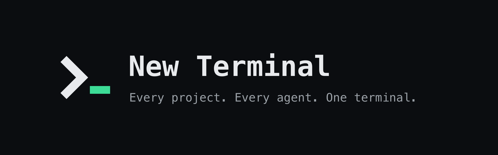

One prompt. Agents do the work.

I started with one constraint: **there is only one prompt.** Not one per project, per window, or per agent. One. You type your intent there, and agents do all of the work. You stop spending cycles on switching windows and deciding where to type what. Read the [vision](VISION.md#the-constraint-one-prompt).

- [Vision](VISION.md): what it is and why
- [Design](DESIGN.md): how it works: keys, syntax, and flows
- [FAQ](FAQ.md): short answers to common questions
- [Glossary](GLOSSARY.md): the shared language for New Terminal
- [License](LICENSE): Apache 2.0
